# BuliPy

A plugin for [Krita](https://krita.org).

## What is BuliPy?
*BuliPy* is a Python plugin made for [Krita](https://krita.org) (free professional and open-source painting program).

The *BuliPy* plugin is an alternative to *Scripter* plugin which is provided by default with [Krita](https://krita.org).

It try provides a different user interface and some additional functionnalities
I use *Scripter* a lot, it's an interesting tool to code and test Krita's dedicated snippets but there's some really boring stuff for me:
- The boring <kbd>Esc</kbd> key
- The boring window still opened when Krita is closes
- Lost work on crash 😅
- No search & replace
- ...

The *BuliPy* tries to provides an advanced functionnalities.

## Screenshots

*Main user interface 1/4*
- Multiple documents opened
- Console output docker with a regular expression search on script output

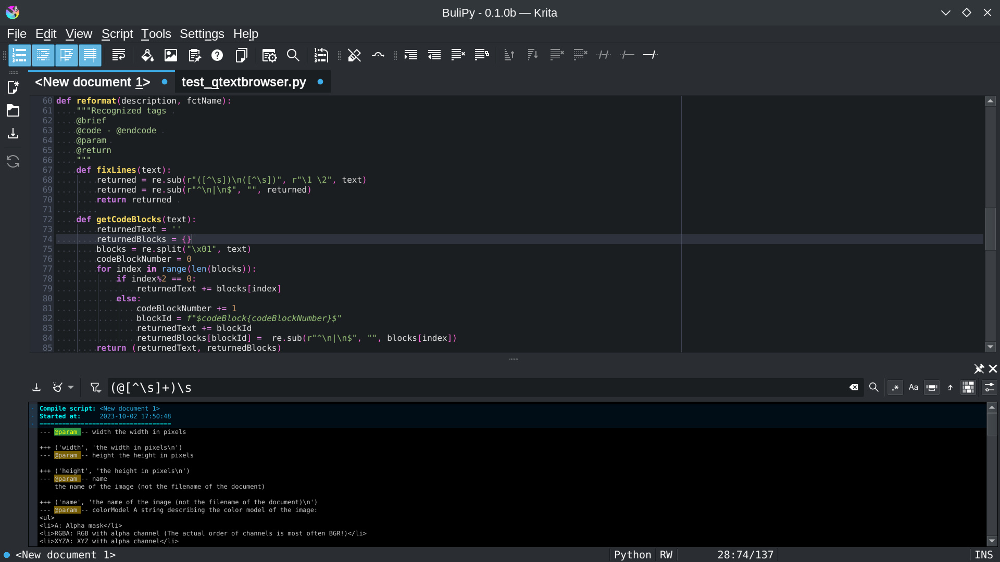

*Main user interface 2/4*
- Multiple documents opened
- Icon selector docker
- Color picker docker
- Console output docker, with `qWarning()` returned in yellow

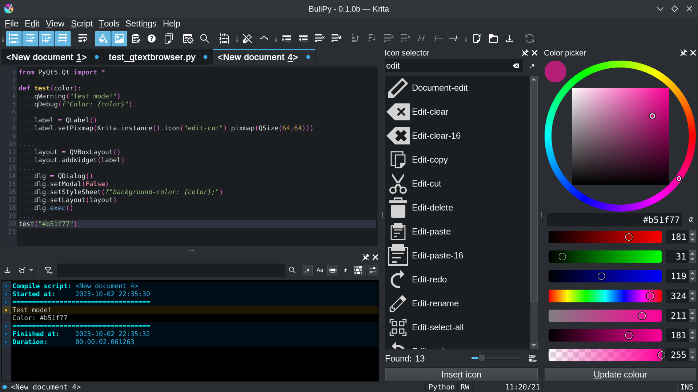

*Main user interface 3/4*
- Multiple documents opened
- Clipboard docker, with tooltip on first clipboard item (Python code, 16 lines)
- Search & Replace docker, with search for `dlg.` to replace with `dialog.`

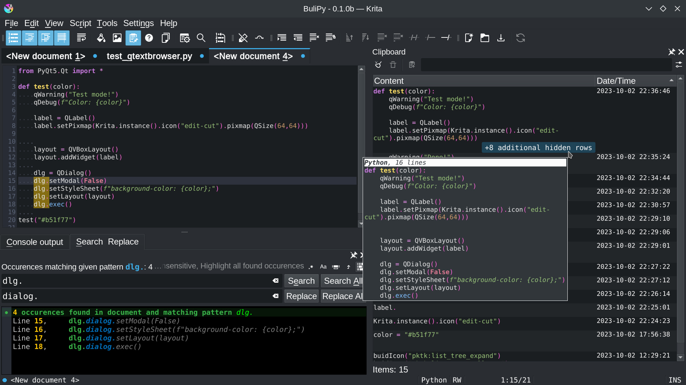

*Main user interface 4/4*
- Document docker
- Quick Krita API docker, filtering list for methods named `create` and looking on `Krita.createDocument()`

## Functionalities

File management

### Open & Save document

File dialog to open & save document provide a quick preview (with syntax highlighting) of file content:

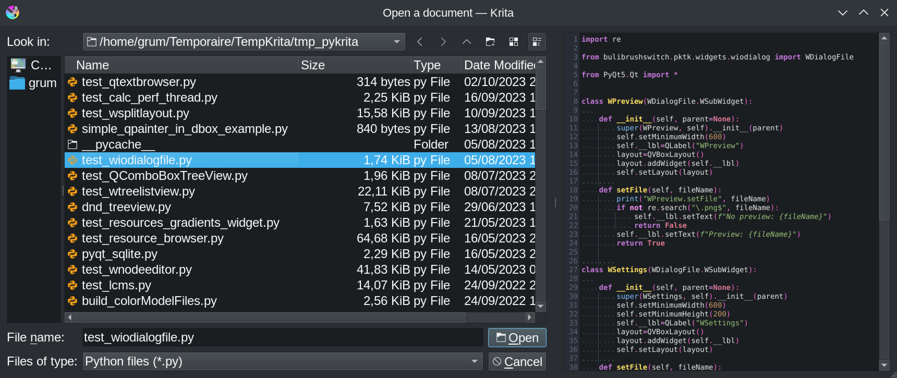

When you have a lot of snippet/test documents, this allows to quickly check which one you want to open.

### File cache
All change made on a document are automatically saved in a cache?
If *BuliPy* is closed (Closed, Krita closed, big crash), on next start you'll get your unsaved document back.

### Multiple opened files
Multiple documents can be opened.
Switch from one to another one with *tabs* or *Document docker*.

> *Note*
> - Blue bullet on *tab* means the document has been modified and not saved
>
>   

### External change detection
Modification made on opened document outside *BuliPy* are detected, and user informed about what to do:

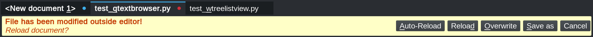

> *Notes*
> - Red bullet on *tab* means the document has been modified outside editor
> - Document is automatically switched to read-only mode unless user decide for an action

### Recents files
Menu *File* > *Recents* provide access to last opened/closed documents.

Editing

### Quick shortcuts

| Shortcut | Action |
| --- | --- |
| <kbd>SHIFT</kbd><kbd>DEL</kbd> | Delete current line Delete selected lines |
| <kbd>CTRL</kbd><kbd>D</kbd> | Duplicate current line Duplicate selected lines |
| <kbd>CTRL</kbd><kbd>/</kbd> | Comment/Uncomment current line Comment/Uncomment selected lines |
| <kbd>TAB</kbd> | Indent selected lines |
| <kbd>SHIFT</kbd><kbd>TAB</kbd> | Dedent selected lines |
| <kbd>CTRL</kbd><kbd>L</kbd> | Go to line |
| <kbd>CTRL</kbd><kbd>F</kbd> | Search and Replace |

### Read-Only mode
Current document can be put in *read-only* mode is needed.
State is keep accross sessions.

### Search & Replace

The *Search & Replace* docker provide some basic functionnalities:

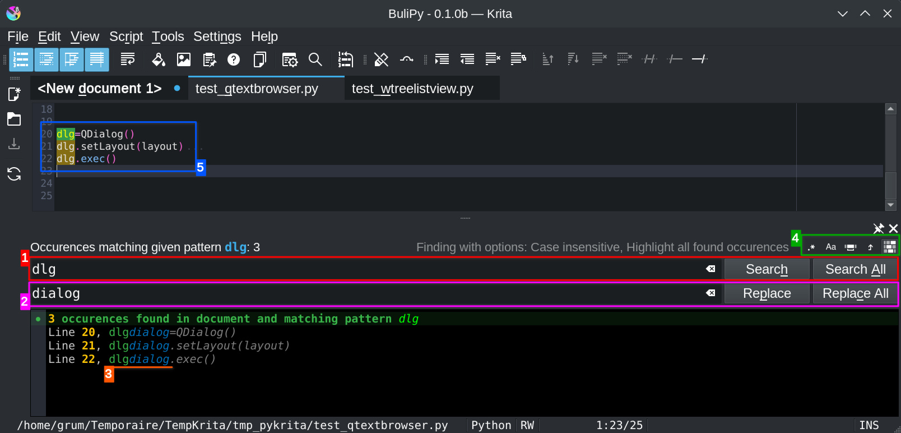

| Ref. | Description |
| --- | --- |
| 1 | Search text |
| 2 | Replace text |
| 3 | Search & Replace results (Need to click on **Search all** button) |
| 4 | Search options - Regular expression - Case sensitive - Whole words only - Backward search - Highlighting found occurences |
| 5 | In green, current found occurence In brown, all found occurences (If *highlighting found occurences* option active) |

View

### Syntax highlighting
Currently, are supported:
- Python
- JSON
- XML

### View 'helpers'
Editor provides some visual helpers:

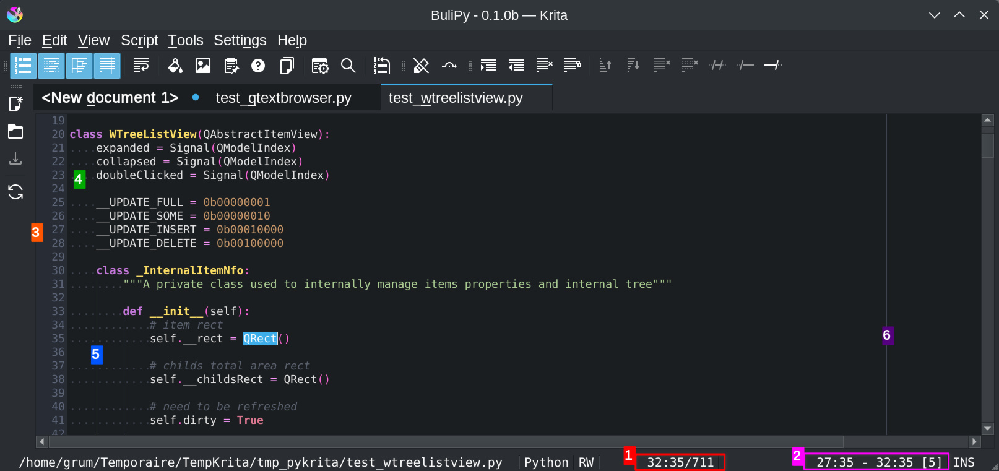

| Ref. | Description |
| --- | --- |
| 1 | Cursor position `column:row/total rows` |
| 2 | Selection *(Selection start)* `column:row` *(Selection end)* `column:row` *(Selection length)* `[size]` |
| 3 | Line number *Show/hide as an option* |
| 4 | Spaces *Show/hide as an option* |
| 5 | Tabs/Indent markers *Show/hide as an option* |
| 6 | Right limit *Show/hide as an option* |
| - | Wrap lines *Active/inactive as an option* |

Script execution & Output console

### Script execution & Output console

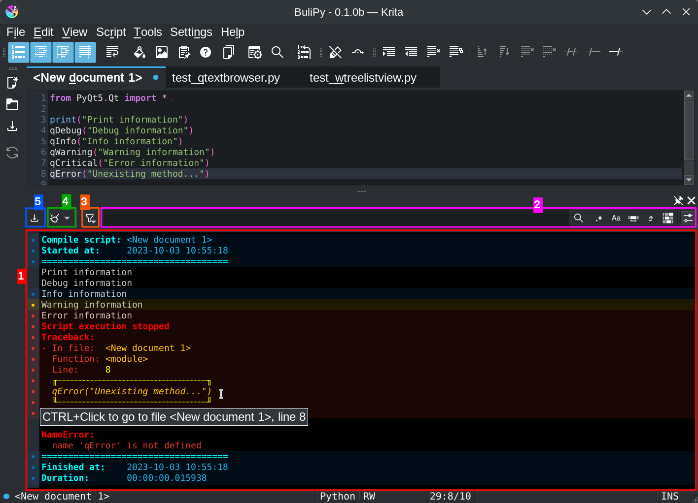

| Ref. | Description |
| --- | --- |
| 1 | Console output: - Provides start, stop and execution times - Colored information matching Qt `qDebug()` (none), `qInfo()` (blue), `qWarning()` (yellow), `qCritical()` (red) - Catched exception with execution stack (no boring dialog box!) |
| 2 | Search function with options to search for specific output into console |
| 3 | Filter options (show debug, warning, error, ...) |
| 4 | Clear console, with ability to automatically clear console when running script |
| 5 | Save console content to file |

> *Notes*
> - Console output is kept in cache for each script
>   - Switch to an another script will switch console content
>   - Reopening session will restore last execution console content 
>     (useful if script generate a crash of Krita: re-opening will show you last execution output before crash)
> - Debugging options for script execution (pause, break point) are not yet implemented

Tools

### Color picker

The provided *Color picker* tool allows to easily insert/update color string into script.
If editor's cursor is moved on a string color (`"#f0897e"` for example) the color picker is updated and provide ability to update color in code from one click.

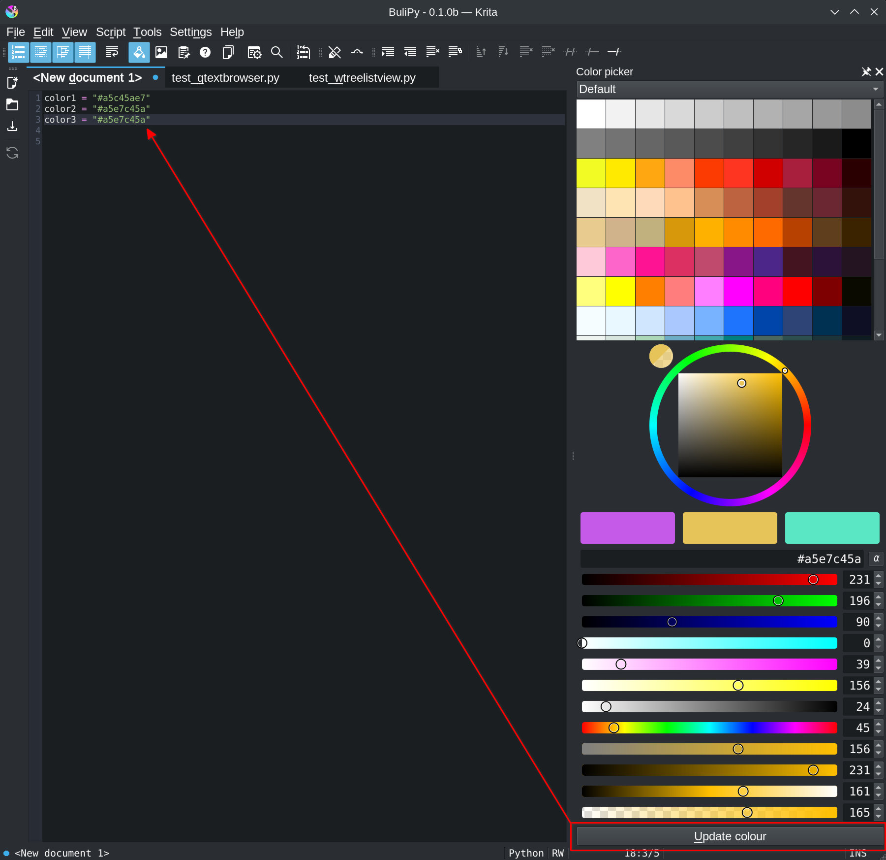

> *Note*
> - Right-click on color picker to customize visible items
>   - Palette
>   - Color wheel
>   - Color combination
>   - RGB Sliders
>   - CMYK Sliders
>   - HSV Sliders
>   - HSL Sliders
>   - Alpha Slider

### Icon selector

The provided *Icon selector* tool allows to easily insert/update Krita's available icons into script.
If editor's cursor is moved on `Krita.instance().icon("icon-name")` icon name, the icon selector is updated and:
- Select icon in list
- Provide ability to update icon in code from one click

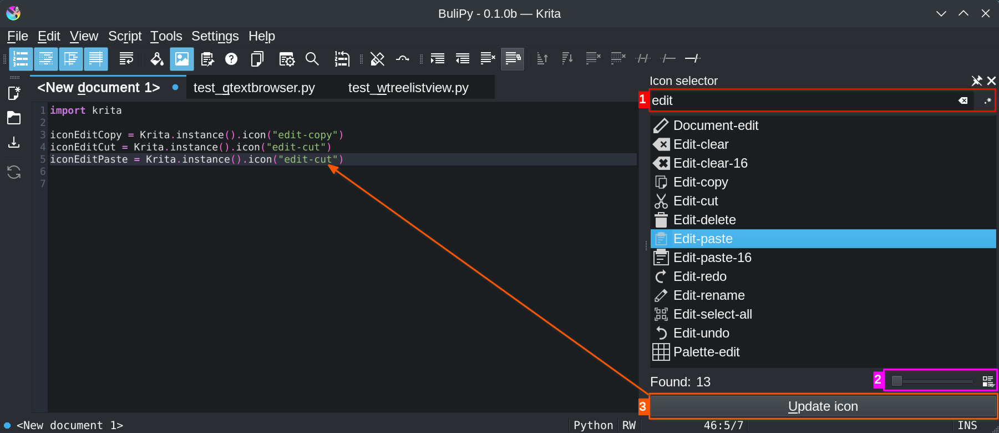

| Ref. | Description |
| --- | --- |
| 1 | Search entry to easily find icon in list |
| 2 | Options for icons size and view mode (list/grid) |
| 3 | Update icon reference in code from one click |

### Documents

A quick overview on opened document, with their status, full path name, last time it has been modified and saved.

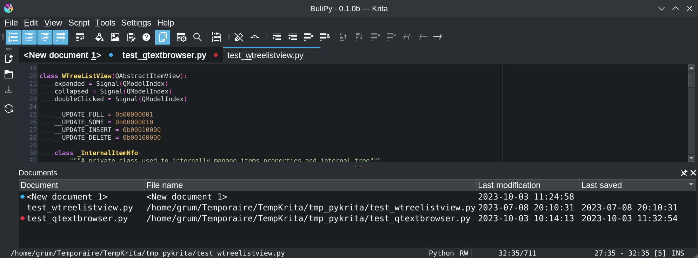

### Advanced clipboard

A clipboard that allows you to avoid doing copy/paste into empty document when you need to get portion of code available quickly.

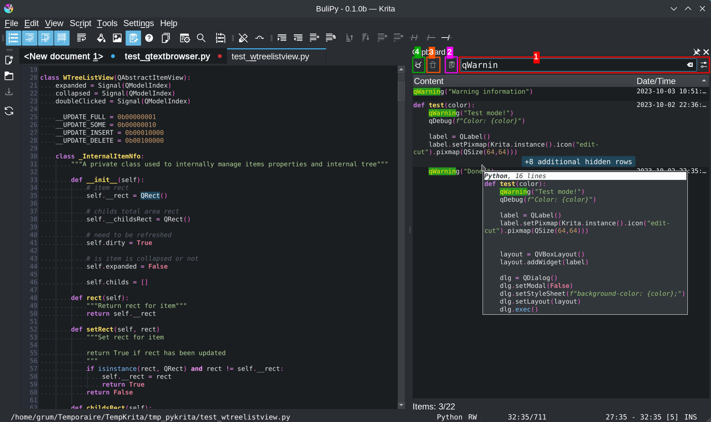

| Ref. | Description |
| --- | --- |
| 1 | Search entry to easily content in clipboard (filtered result + found text occurence are highlighted) |
| 2 | Push back selected content to cipboard |
| 3 | Delete selected cotent from clipboard |
| 4 | Clear clipboard |

> *Notes*
> - Clipboard only manage content copied/cut from *BuliBy*, any content put in OS clipboard from other application is ignored
> - Tool need some improvement, check plugin's ***What’s next?*** section

### Quick Krita API

Krita's documentation embedded in a docker, allowing quick search from Class and/or Method name.

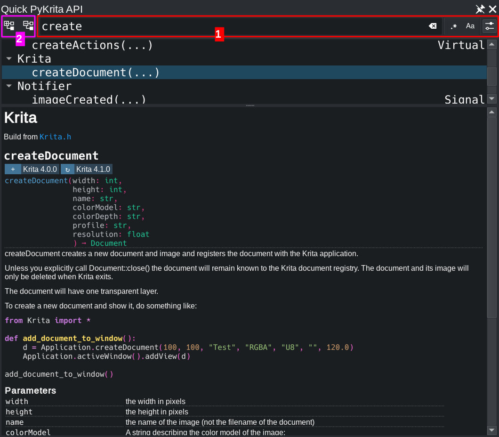

| Ref. | Description |
| --- | --- |
| 1 | Search entry to filter class/methods and get wuick access to documentation |
| 2 | Expoand/Collapse all classes |

> *Notes*
> - Tool tries to provides a more readable information than one provided on official [Krita's API](https://api.kde.org/krita/html/) site which is:
>   - Hard to read especially since it has been moved to KDE api hosting
>   - Oriented to C developpers (Doxygen generate document from C, then using C definition and types, ...)
> - Documentation is built from scratch from Krita source code (.h files) with a dedicated *BuliBy* internal script; then generated documentation:
>   - Is Python oriented (use python syntax and types instead of C)
>   - Is able to provide from which Krita version a class/method has been implemented the first time, and updated for the last time

### Files properties to clipboard

Menu *Tools* > *Copy to clipboard* let you copy to clipboard current file properties:
- Full path/file name
- Path name
- File name

> *Note*
> - Click on file name in status bar will copy *Full path/file name* in clipboard

### Manipulation document
Some function to manipulate text are available through menu *Tools* > *Manipulate document*:
- Sort ascending
- Sort descending
- Remove duplicate lines
- Remove empty lines (considered as empty: lines with only spaces)
- Trim lines (leading spaces, trailing spaces, both)

> *Notes*
> - To avoid mistakes, some functions are not available according to document type (sort is available on text files only for example)
> - It's possible to undo manipulation actions with usual <kbd>CTRL</kbd><kbd>Z</kbd>

Settings

### Preferences

Plugin preferences for:
- Documents
  - Default documents type
  - Automatic space trailing on save
- Editor
  - Appareance (font, theme)
  - Editing (right limit, indent, enclosing characters)
- Script execution
  - manage `sys.path`
- Toolbars
  - Configure toolbars

### Toolbars

Display/hide toolbars

Help

### PyKrita API
Open *BuliPy* PyKrita API documentation in browser (local files).

### Krita Scripting School
Open *Krita Scripting School* website in browser.

### PyKrita Python definition for IDE
If your IDE support Python language and can interpret python files, you can download [krita.py](https://github.com/Grum999/BuliPy/blob/main/bulipy/bulipy/bp/resources/docs/krita.py) from repository and use it for your IDE.

## Download, Install & Execute

### Download
+ **[ZIP ARCHIVE - v0.1.0b](https://github.com/Grum999/BuliPy/releases/download/0.1.0b/bulipy.zip)**
+ **[SOURCE](https://github.com/Grum999/BuliPy)**

### Installation

Plugin installation in [Krita](https://krita.org) is not intuitive and needs some manipulation:

1. Open [Krita](https://krita.org) and go to **Tools** -> **Scripts** -> **Import Python Plugins...** and select the **bulipy.zip** archive and let the software handle it.
2. Restart [Krita](https://krita.org)
3. To enable *BuliPy* go to **Settings** -> **Configure Krita...** -> **Python Plugin Manager** and click the checkbox to the left of the field that says **BuliPy**.
4. Restart [Krita](https://krita.org)

### Execute

Once installed, simply go to menu **Tools**, **BuliPy** entry should be available.
It's possible to affect a shortcut to plugin through Krita's shortcuts configuration dialog.

### Tested platforms

Plugin requires at least Krita 5.2.0 (Linux appimage)
Not tested on windows & MacOs

## Plugin's life

### What's new?

_[2023-10-04] Version 0.1.0b_ *[Show detailed release content](./releases-notes/RELEASE-0.1.0b.md)*
- First implemented/released version!

### Bugs

Maybe boring but probably not blocking.

Since krita 5.2, for some user like me, typing dead keys like circumflex character `^` doesn't work anymore: if you have the problem, it's not related to plugin
> A [bug](https://bugs.kde.org/show_bug.cgi?id=469691) has been opened on Krita side for this case...

### What’s next?

> ***BuliPy* plugin is not an IDE**
> Even if it provides more functionnalities than default *Scripter*, it's not the goal to have a complete IDE 🙂

Some stuff I still have to implement
- Improve search (search next, pre-fill search text with current selected text)
- Split window (view mutliple document at the same time)
- Theme editor (let user define is own color syntax setup)
- Theme integration (currently 'dark' themes are supported, 'light' themes are partially supported)
- Manipulate document: filter from rules
- Manipulate document: Pretiffy function for JSON/XML

Some functionalities I may or maynot implement, according to my availability:
- Code folding
- Block/Column mode selection
- Debugger with breakpoint
- Allows user to define own shortcut mapping keys

Some functionalities I will probably not implement:
- Linter
- Auto-completion

## License

### *BuliPy* is released under the GNU General Public License (version 3 or any later version).

*BuliPy* is free software: you can redistribute it and/or modify it under the terms of the GNU General Public License as published by the Free Software Foundation, either version 3 of the License, or any later version.

*BuliPy* is distributed in the hope that it will be useful, but WITHOUT ANY WARRANTY; without even the implied warranty of MERCHANTABILITY or FITNESS FOR A PARTICULAR PURPOSE. See the GNU General Public License for more details.

You should receive a copy of the GNU General Public License along with *BuliPy*. If not, see <https://www.gnu.org/licenses/>.

Long story short: you're free to download, modify as well as redistribute *BuliPy* as long as this ability is preserved and you give contributors proper credit. This is the same license under which Krita is released, ensuring compatibility between the two.
